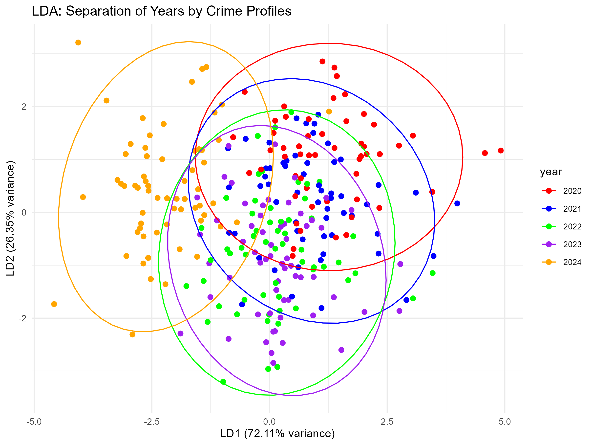
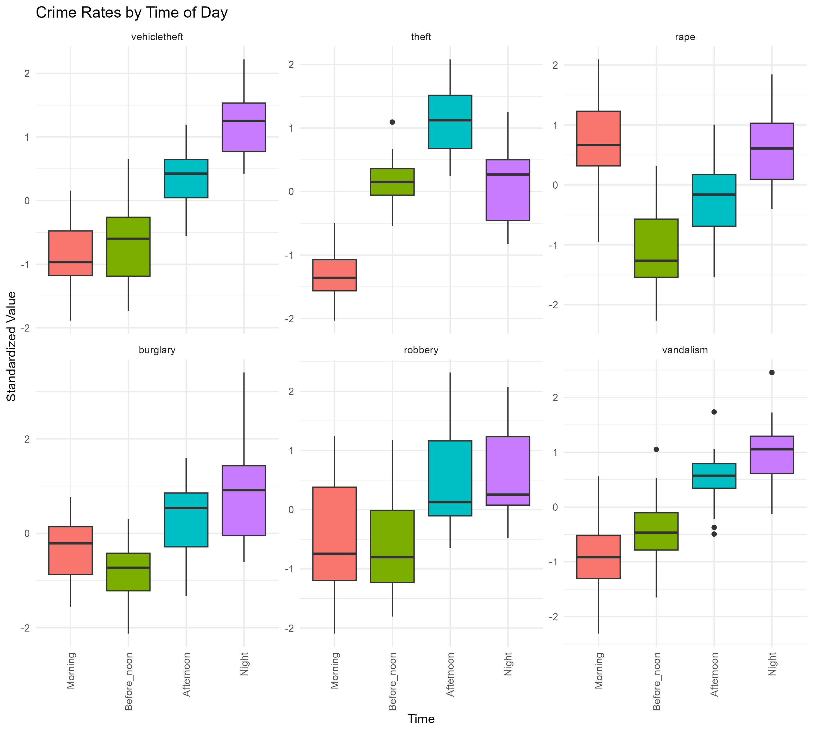
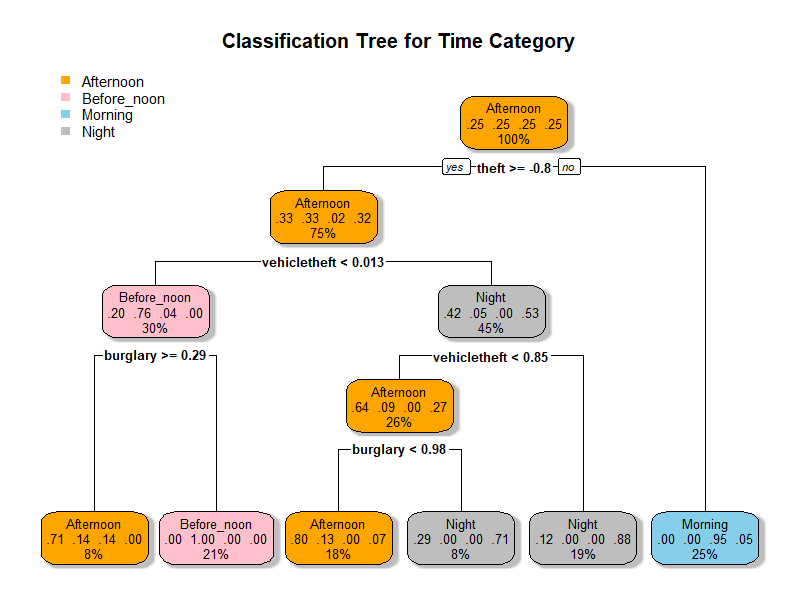

# Crime Analysis in Los Angeles (2020–2024)


## Overview
This project analyzes crime data in Los Angeles from 2020 to 2024 to address three research questions:
1. **Have crime types changed over the last five years?**
2. **Do crime types differ by time of day?**
3. **Can we predict the time of day when specific crime types are likely to occur using machine learning?**

The dataset, sourced from `Crime_Data_2020_to_Present.csv`, includes crime reports with details on date, time, area, and crime descriptions. We focus on six crime types: vehicle theft, theft, rape, burglary, robbery, and vandalism. The analysis uses statistical methods (MANOVA, PERMANOVA, LDA) and machine learning techniques (KNN, classification trees) to explore temporal and diurnal crime patterns. Additionally, spatial crime data is provided as shapefiles in the `input/` folder.

---

## Repository Structure
- **`/data`**: Contains raw (`Crime_Data_2020_to_Present.csv`) and processed datasets (`data_summary.csv`, `manova_df.csv`, `crime_time_data.csv`).
- **`/input`**: Contains shapefiles for crime data (e.g., `crime_2020.shp`, `crime_2021.shp`, ..., `crime_2024.shp`, each with `.shx`, `.dbf`, `.prj` components).
- **`/scripts`**: R scripts for data preprocessing, statistical analysis, and machine learning (`crime_analysis.R`).
- **`/figures`**: Visualizations including LDA scatterplots (`lda_plot.png`), boxplots (`boxplots_crime_time.png`), mean plots (`mean_plots_crime_time.png`), and classification trees (`rpart_plot.png`).
- **`/results`**: Saved RData files (`lda_results.RData`, `manova_time_crime_time_data.RData`, `anova_time_crime_time_data.RData`, `tukey_time_crime_time_data.RData`).
- **`crime_analysis_report.Rmd`**: R Markdown file for generating the project report.

---

## Methodology

### Data Preprocessing
- **Source**: `Crime_Data_2020_to_Present.csv`.
- **Features**:
  - Date reported (`Date.Rptd`), time of occurrence (`TIME.OCC`), area (`AREA`), crime description (`Crm.Cd.Desc`).
  - Time categorized into Morning (00:00–06:00), Before Noon (06:00–12:00), Afternoon (12:00–18:00), Night (18:00–23:59).
- **Cleaning**:
  - Parsed dates to ISO format, filtered out 2025 data and incomplete records.
  - Created binary indicators for six crime types using regex.
  - Summarized crime counts by year, time, and area.
  - Applied `log(x+1)` transformation and standardization to address skewness.
- **Shapefiles**: Spatial crime data for 2020–2024 in `input/` (e.g., `crime_2020.shp`).

### Research Question 1: Crime Types Over Time
- **Methods**:
  - **PERMANOVA**: Tested differences across years (due to Box’s M test violation, p = 5.806e-09).
  - **Welch’s ANOVA**: Univariate comparisons with Bonferroni correction.
  - **Games-Howell Post-Hoc**: Identified year-to-year differences.
  - **Linear Discriminant Analysis (LDA)**: Classified years by crime profiles.
- **Assumptions**: Checked normality (Mardia’s test), correlations, scatterplot matrices.

### Research Question 2: Crime Types by Time of Day
- **Methods**:
  - **MANOVA**: Tested differences across time periods.
  - **Univariate ANOVAs** and **Tukey HSD**: Examined crime-specific differences.
  - **LDA**: Classified time periods.
- **Assumptions**: Normality (Mardia’s test), homogeneity (Box’s M, p = 0.8846).

### Research Question 3: Predicting Time of Day
- **Methods**:
  - **K-Nearest Neighbors (KNN)**: Tuned k (1–15) with 10-fold cross-validation.
  - **Classification Tree**: Tuned complexity parameter (cp = 0.01–0.1).
  - Evaluated using confusion matrices and accuracy.

---

## Results

### Research Question 1: Crime Types Over Time
- **PERMANOVA**: Significant differences across years (p < 0.001).
- **Welch’s ANOVA**: All crime types varied significantly (p < 0.05, Bonferroni-adjusted).
- **Games-Howell**: Higher vehicle theft in 2023–2024, lower rape in 2020.
- **LDA**: 73.2% test accuracy, 70.1% LOOCV accuracy, with good separation for 2020/2024.



### Research Question 2: Crime Types by Time of Day
- **MANOVA**: Significant differences (Pillai’s trace = 2.011, p < 2.2e-16).
- **ANOVAs**: All crime types varied by time (p < 0.05).
- **Tukey HSD**: Night had higher robbery/vandalism, Afternoon had higher burglary.
- **LDA**: 68.5% accuracy, strong separation for Night.



### Research Question 3: Predicting Time of Day
- **KNN**: Optimal k = 5, 65.8% cross-validation accuracy.
- **Classification Tree**: Optimal cp = 0.02, 62.3% accuracy.
- Night predictions were most accurate.



---

## Conclusions
- **RQ1**: Crime types changed significantly, with increased vehicle theft (2023–2024) and reduced rape (2020).
- **RQ2**: Crime types vary by time, with Night (robbery, vandalism) and Afternoon (burglary) peaks.
- **RQ3**: KNN outperformed classification trees (65.8% vs. 62.3% accuracy), with Night most predictable.

---

## Dependencies
- R packages: `pacman`, `readxl`, `dplyr`, `lubridate`, `car`, `stats`, `reshape2`, `factoextra`, `corrplot`, `rstatix`, `stringr`, `bestNormalize`, `tidyverse`, `caret`, `GGally`, `MVN`, `skimr`, `magrittr`, `biotools`, `vegan`, `class`, `rpart`, `rpart.plot`, `sf` (for shapefiles).
- Install via:
  ```R
  pacman::p_load(readxl, dplyr, lubridate, car, stats, reshape2, factoextra, corrplot, 
                 rstatix, stringr, bestNormalize, tidyverse, caret, GGally, MVN, 
                 skimr, magrittr, biotools, vegan, class, rpart, rpart.plot, sf)
